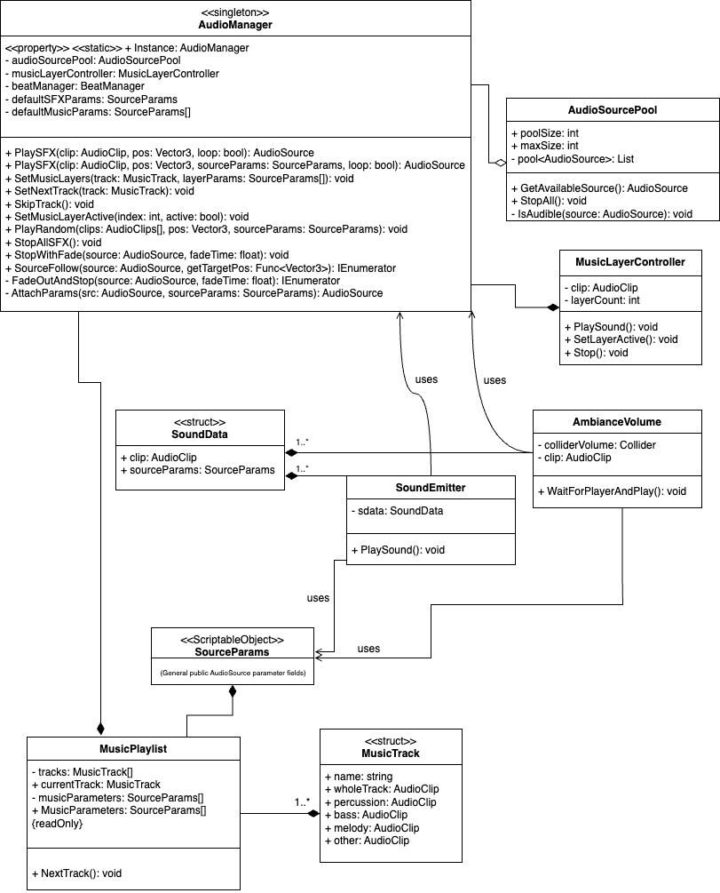

# SoundManager Design Document for Unity

## 1. Overview

### 1.1 Purpose  
The SoundManager will manage all audio playback in the game, including sound effects, music, and ambient sounds, utilizing an an audio source pool to have consistent availability, preventing audio cut-offs and other issues. Sound emitters will easily be able to be called by any UnityEvent for ease of use.

### 1.2 Scope  
The SoundManager will handle one-shot sound effects, looping sounds, background music, music layering. It will support spatial and non-spatial audio and constant position tracking of desired objects to play audiosources at.

---

## 2. Requirements

### 2.1 Functional Requirements  
- Play one-shot sound effects anywhere in the game.  
- Play background music with fade in/out transitions.  
- Support layered music (e.g., add percussion when cycling etc.).  
- Control separate volumes for music and SFX.  
- Manage AudioSource pool to optimize performance and prevent audio cut-offs.  
- Support 3D spatial sound for environmental audio.

### 2.2 Non-Functional Requirements  
- Minimal impact on game performance.  
- Easy integration with game events and scripts.  

---

## 3. Architecture and Design

### 3.1 System Structure 

#### General Class Diagram of the System

### 3.2 SoundManager Class  
- Singleton pattern to ensure one global instance.  
- Public API for playing sounds wtih useful overloads such as source position (e.g., `PlaySound`, `SetNextTrack`, and `SkipTrack`).  
- Interacting classes can pass in `SourceParams` Scriptable Object class that gets attached to available sources on demand. Can be left empty in some cases. (See diagram.)

### 3.3 AudioSource Pooling  
- Pre-instantiate a fixed number of AudioSources.  
- Reuse AudioSources to avoid runtime allocations.  
- Dynamically increase AudioSource count based on requests from other scripts up to a certain maximum.
- Handle concurrency (multiple sounds playing at once).
- Disable unused audiosources to limit unnecessary performance liabilities.

### 3.4 SoundEmitter Class
- Store multiple audio clip and source param packs as Sound Data array and play with unity events, directly, or by passing in a specialized enum from an outer script to play specific a sound associated with a specific index.

### 3.5 Ambiance Volume Class
- Asks for an available audio source when player spawns in, releases to pool when source is inaudible.

### 3.6 Music Layer Controller Class  
- Support multiple AudioSources for music layers.  
- Allow dynamic enabling/disabling of layers based on game state or any other custom logic.

### 3.7 Beat Manager
- Assign events on beats or in between beats based on track bpm.

### 3.8 Music Playlist
- Keeps Tracks associated with the current scene as a `MusicTracks` struct array.
- Assigns initial parameters as scriptable objects for *each* music layer (Percussion, Bass, Lead, Harmony, Other etc.).
- Handles changing tracks through `SkipTrack`,`PreviousTrack`,`PlayTrack`.
- Can pause and unpause tracks.

---
---

# Some aspects of the system, such as the pool optimazation and track managament, are still in development. Expect feature updates and refactoring.
